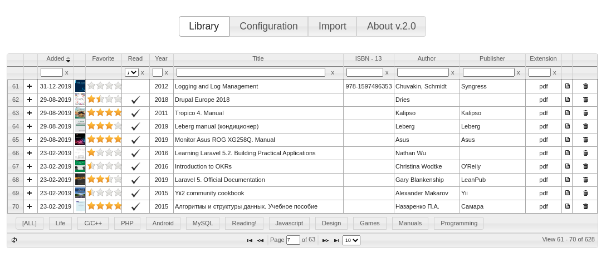
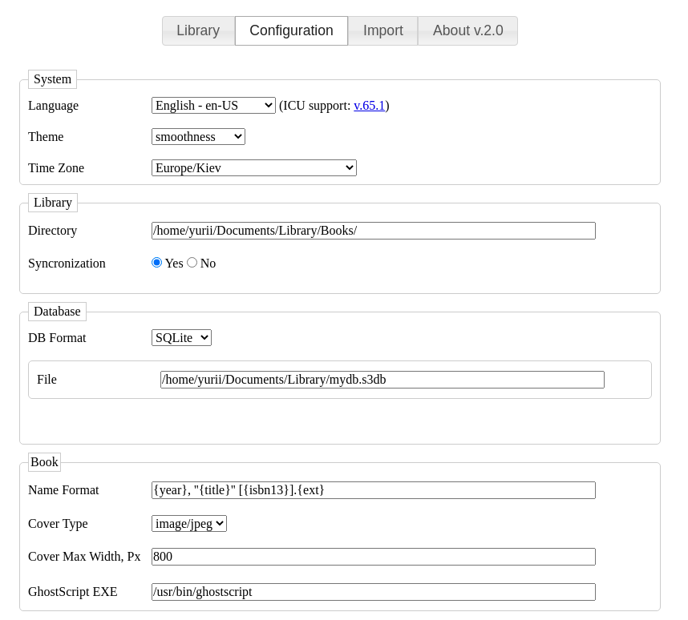
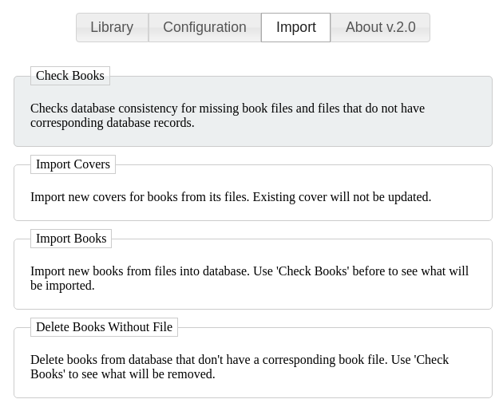

[](https://travis-ci.com/yurii-github/my-library) [](https://codeclimate.com/github/yurii-github/my-library/maintainability) [](https://codeclimate.com/github/yurii-github/my-library/test_coverage)

This is book library manager, written in PHP and based on Slim4 and JqueryUI.  
The main purpose of it is to manage own book library as excel table with ratings and other stuff like filename synchronizations of your books and more.  
It supports all JQuery UI themes.  





  

## Functionality

- excel table is sortable, pagable
- books CRUD
- books categories
- book cover is saved to database
- book cover can be dropped in web interface
- book cover can be imported from PDF (you need to have [ghostScript](https://www.ghostscript.com/))
- web interface is fully themed (all JqueryUI themes)
- i18n
- MySQL and SQLite support
- synchronization with filesystem (renames, deletes)
- migrations
- configuration is done via web interface


## Requirements

- PHP 7.4 or higher
- SQLite or MySQL database


## Setup & Run

```
git clone git@github.com:yurii-github/my-library.git
cd my-library
composer update
./serve
```


Application will be available at [http://localhost:8080](http://localhost:8080)

## Structure
Here's the list of most interesting places: 
<pre>
├── data            -  -  -  -  -  -  -  - your data is stored here
│   ├── config.json          -  -  -  -  - settings set via web interface
│   └── mydb.s3db            -  -  -  -  - book SQLite database
├── src
├── tests
├── public
│   ├── 3rd         -  -  -  -  -  -  -  - 3rd party assets
│   ├── assets      -  -  -  -  -  -  -  - our assets
├── └── index.php   -  -  -  -  -  -  -  - entry point of the application  
└── serve           -  -  -  -  -  -  -  - run webapp locally
------
</pre>


## Sync

If you have enabled synchronization application will sync changes to your filesystem!

* Any cell change that has influence on filename of the book will cause its rename
* If you delete book in MyLibrary it will delete corresponding real file if sync is *ON* 
* You cannot remove records without corresponding real file if sync is *ON*
* You have to manage file extension manually to rename file properly.
* If you change book filename format it will not rename all books! It will apply new format only to newly renamed books


## Importing new books

To import books into the library you have to drop your books to library folder you've set in configuration and then on *Synchronization* tab press "import fs only". 
It will import all file system books that are not in database yet.
