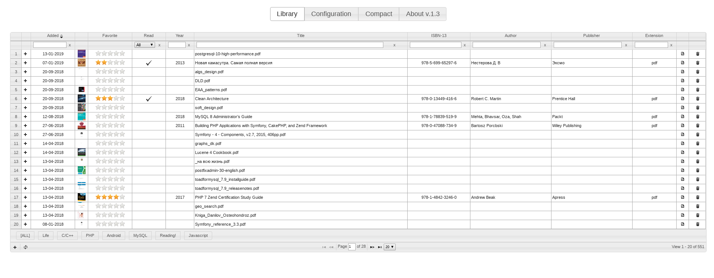

# My Library

[](https://travis-ci.org/yurii-github/yii2-mylib) [](https://codeclimate.com/github/yurii-github/yii2-mylib) [](https://codeclimate.com/github/yurii-github/yii2-mylib/coverage) 

## About

This is book library manager, written in PHP and based on JqueryUI.  
The main purpose of it is to manage own book library as excel table with ratings and other stuff like filename syncronizations of your books and more.  
It supports all JQuery UI themes.  




## Functionality

- excel table is sortable, pagable
- books CRUD
- books categories
- book cover is saved to database
- book cover can be dropped in web interface
- book cover can be imported from PDF (you need to have [ghostScript](https://www.ghostscript.com/))
- web interface is fully themed (all JqueryUI themes)
- i18n
- MySQL and SQLite support
- synchronization with filesystem (renames, deletes)
- migrations
- compact: optimizes DB via run vacuum for SQLite or table optimization for MySQL
- configuration is done via web interface

## Requirements

- PHP 7.2+
- SQLite or MySQL database

## Setup & Run

Get project code

```
git clone git@github.com:yurii-github/yii2-mylib.git
cd yii2-mylib
composer update
```

Start this application as

```
./serve
```

Application will be available at [http://localhost:8080](http://localhost:8080)

## Structure
Here's the list of most interesting places: 
<pre>
├── data            -  -  -  -  -  -  -  - your data is stored here
│   ├── config.json          -  -  -  -  - settings set via web interface
│   └── mydb.s3db            -  -  -  -  - book SQLite database
├── src
├── tests
├── public
│   ├── 3rd         -  -  -  -  -  -  -  - 3rd party assets
│   ├── assets      -  -  -  -  -  -  -  - our assets
├── └── index.php   -  -  -  -  -  -  -  - entry point of the application  
└── serve           -  -  -  -  -  -  -  - run webapp locally

--------
│   ├── config
│   │   └── config.local.php -  -  -  -  - your custom app configuration (that cannot be set via settings)
------
</pre>

## Sync
If you have enabled synchronization application will sync changes to your filesystem
* any cell change that has influence on filename of the book will cause its rename
* if you delete book it will be removed from filesystem too 
* you cannot remove records without corresponding real file (you may disable sync if required)
* you have to manage file extension manually to rename file properly.
* if you change book filename format it will not rename all books! It will apply new format only to newly renamed books

## Importing new books
The simplest way is to drop your books to library folder you've set in configuration and then on "synchronization" press "import fs only". 
It will import all file system books that are not in database yet.
